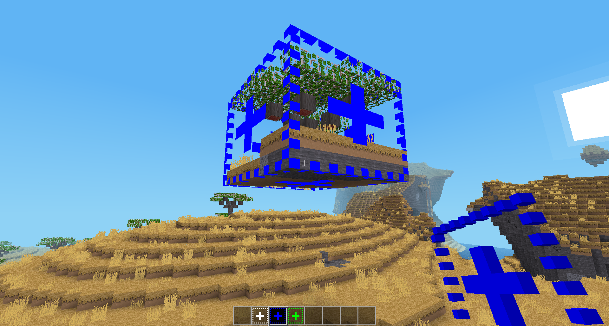
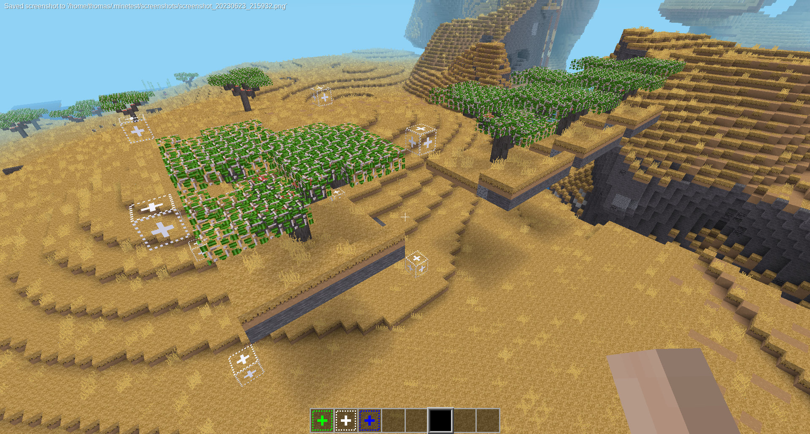

Pick and place tool for minetest

# Features

* Select and place areas on the fly
* Configure an area with "handles" to pick and place them quickly

# Screenshots

# Howto

## Quick pick-and-place

Simple copy+paste operation

* Use the green `pick_and_place:pick` tool to select the area to use
* First click for first position and second click for the second position
* This will convert the pick-tool to a blue `pick_and_place:place` tool in your inventory
* Use the place-tool to place your build anywhere in the world with the help of the preview-overlay

## Configure a template area

Create a template for frequent reuse

* Use the white `pick_and_place:configure` tool to select an area for your template
* First click for first position and second click for the second position
* This will create "handle" nodes on every corner of the build
* Right-click the corners to create a placement-tool for the template
* Place as needed

# Limitations

The schematic data is stored in the tool and may not scale well beyond a certain size

# Licenses

* Code: `MIT`
* Media: `CC-BY-SA 3.0`
